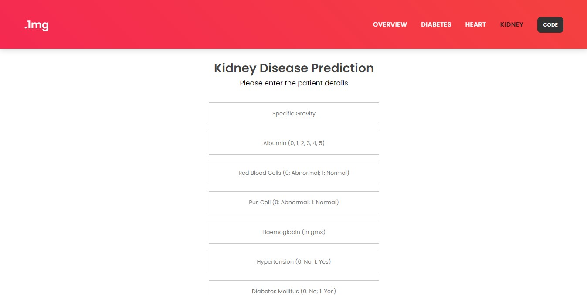

# Health Assessment System
   


## About

>An Health Assessment system was developed using Flask Web Framework and was deployed on a web server. The objective is to predict whether the patient has a disease based on various dataset features. The web app can predict the following Diseases:

- Diabetes
- Heart Disease
- Kidney Disease


## Models with their Accuracy of Prediction

| Disease        | Type of Model            | Accuracy |
| -------------- | ------------------------ | -------- |
| Diabetes       | Machine Learning Model   | 74.48%   |
| Heart Disease  | Machine Learning Model   | 85.25%   |
| Kidney Disease | Machine Learning Model   | 97.05%   |


## NOTE

> You can access the website live at: https://health-assessment-system-62pz.onrender.com <br>
Python version 3.10.9 was used for the whole project.<br>


## Steps to run this application in your system

1. Clone or download the repo.
 
2. Open the command prompt in the downloaded folder.

3. Install all the dependencies:

```
pip install -r requirements.txt
```

4. Run the application

```
python app.py
```


## Dataset Links

All the datasets were used from Kaggle.

- [Diabetes Dataset](https://www.kaggle.com/uciml/pima-indians-diabetes-database)
- [Heart Disease Dataset](https://www.kaggle.com/ronitf/heart-disease-uci)
- [Kidney Disease Dataset](https://www.kaggle.com/mansoordaku/ckdisease)


## Technologies Used:

     


## Sample images of the web application

### Home Page

<br>

### Diabetes Disease Predictor

<br>

### Heart Disease Predictor

<br>

### Kidney Disease Predictor

<br>

### Negative Result Page

<br>

### Positive Result Page


## Conclusion

A multiple disease prediction machine learning model can be a powerful tool in healthcare for the early detection and diagnosis of various diseases. The model can provide accurate predictions of the likelihood of developing different diseases by analyzing a patient's medical history and risk factors.

Various machine learning algorithms can be used for multiple disease prediction, including logistic regression, support vector machines, decision tree, radom forest and xgboost. The choice of algorithm depends on the nature of the data, the number of features, and the computational resources available.

Overall, a multiple disease prediction machine learning model has the potential to improve healthcare outcomes by enabling early detection and intervention, leading to better patient outcomes and reduced healthcare costs.
